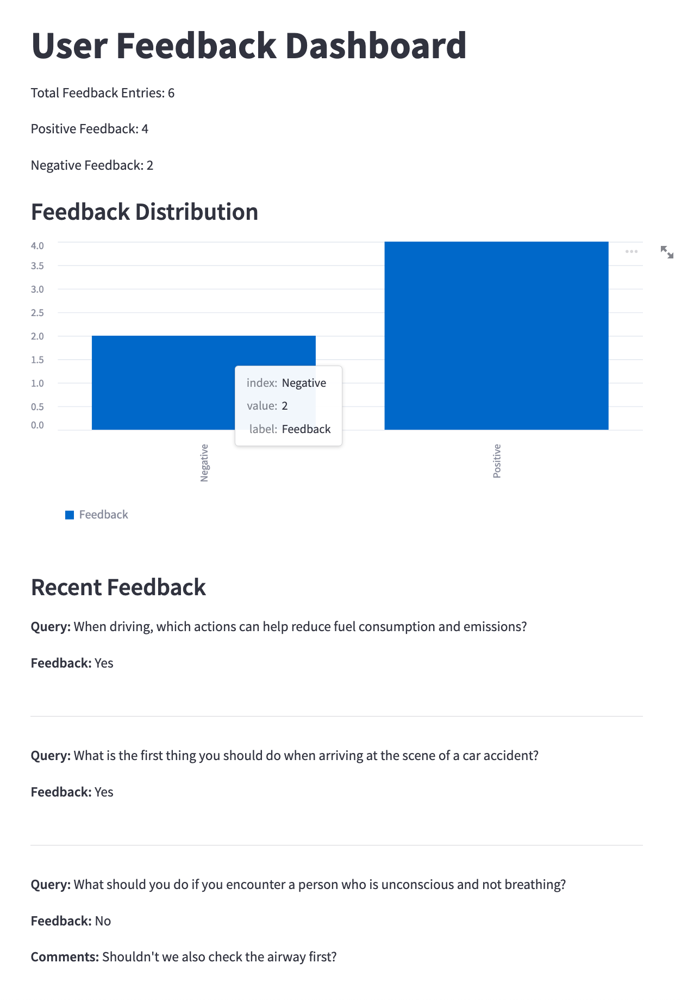

# AI Driving Instructor: Your Companion for the German Driving Theory Exam


## Problem Statement

Preparing for the German driving theory exam can be a challenging endeavor. Aspiring drivers must familiarize themselves with an extensive array of traffic rules, road signs, and safety regulations specific to Germany. Traditional study methods like textbooks and passive learning often fail to provide the interactive and personalized experience needed to effectively grasp these concepts.

**AI Driving Instructor** is an interactive learning tool designed to help individuals prepare for the German driving theory exam efficiently and effectively. The application presents users with AI-generated exam questions, allowing them to select their answers in a quiz format. After each attempt, the AI Driving Instructor evaluates the responses, providing immediate feedback and detailed explanations for any mistakes made. This personalized guidance helps users understand the reasoning behind correct answers, reinforces learning, and addresses knowledge gaps.

By leveraging artificial intelligence and large language models (LLMs), the AI Driving Instructor offers a tailored educational experience that adapts to the user's learning pace and needs. The goal is to enhance comprehension, boost confidence, and ultimately increase the chances of passing the German driving theory exam.

**DISCLAIMER**: this project uses synthetic data generated by an LLM and was created for learning purposes, don't use it to prepare for your German driving theory exam.

## Features

* **Practice Mode**: Users can select a theme and answer randomly generated questions in a quiz format.
* **Ask a Question**: Users can input their own questions about the German driving theory exam, and the AI will provide answers using a Retrieval-Augmented Generation (RAG) approach.
* **Immediate Feedback**: The app provides instant feedback on quiz answers, including correct answers and explanations.
* **Interactive Interface**: A user-friendly Streamlit application for an engaging learning experience.
* **User Feedback Mechanism**: In the "Ask a Question" mode, users can provide feedback on the AI-generated answers, helping improve the application's performance.
* **User Feedback Dashboard**: An administrative dashboard (dashboard.py) displays collected feedback, providing insights into user interactions and areas for improvement.


## Dockerization

The application is containerized using Docker with Python 3.10 to ensure compatibility with the development environment.

#### Prerequisites

- Docker and Docker Compose installed.
- OpenAI API key.

#### Steps

1. **Set your OpenAI API Key:**

   - On macOS/Linux:

     ```bash
     export OPENAI_API_KEY='your-api-key-here'
     ```

   - On Windows:

     ```cmd
     set OPENAI_API_KEY=your-api-key-here
     ```

2. **Build and Run the Containers:**

   ```bash
   docker-compose up --build
   ```
3. **Access the App and Dashboard**:

* App: http://localhost:8501
* Dashboard: http://localhost:8502

## Data Generation

### Why Synthetic Data?

To avoid copyright issues with proprietary driving theory questions, we generate a synthetic dataset using OpenAI's GPT-3.5 language model.

### Prerequisites

- Python 3.10.9
- OpenAI Python library
- OpenAI API key

### Steps to Generate Data

1. **Install Dependencies**

   ```bash
   pip install -r requirements.txt
   ```

2. **Set Up OpenAI API Key**

    - Obtain an API key from OpenAI.
    - Set the API key as an environment variable:
        - On macOS/Linux:
            ```bash
            export OPENAI_API_KEY='your-api-key-here'
            ```
        - On Windows:
            ```cmd
            set OPENAI_API_KEY=your-api-key-here
            ```

3. **Run the Data Generation Script**

    ```bash
    python generate_data.py
    ```

    This will generate `data/generated_questions.json`.

4. **Run the Ground-Truth Generation Script (Optional)**

    ```bash
    python generate_ground_truth.py
    ```

    This will generate `data/ground_truth.json`.

## Installation

1. **Clone the Repository**

   ```bash
   git clone https://github.com/mac2bua/ai-driving-theory-teacher.git
   cd ai-driving-theory-teacher
   ```

2. **Install Dependencies**

    Note: before installing the requirements you should create a Python environment using conda or pipenv.

    ```bash
    pip install -r requirements.txt
    ```

## Data Ingestion and Preparation

Before running the application, you need to prepare the data and create the necessary indexes for retrieval.

1. **Generate Embeddings and FAISS Index**

    ```bash
    python prepare_data.py
    ```

    This script will:
    - Load the generated questions.
    - Encode the questions using a Sentence Transformer model.
    - Create a FAISS index for efficient similarity search.
    - Save the index and the mapping of indices to questions.

2. **Ground Truth Data (Optional)**

    If you wish to evaluate the retrieval methods, you can use the provided `ground_truth.json` file.


## Running the Application

1. Start the Streamlit App

    ```bash
    streamlit run app.py
    ```

2. Access the App

    Open your web browser and navigate to http://localhost:8501.


## Application Modes

### Practice Mode
- Select a theme from the sidebar.
- Click "Get Random Question" to receive a question.
- Choose your answers and submit.
- Receive immediate feedback and explanations.

### Ask a Question
- Navigate to "Ask a Question" mode from the sidebar.
- Enter your question about the German driving theory exam.
- The AI will provide an answer using the RAG approach.
- Optionally, view the retrieved context used to generate the answer.
- Provide Feedback:
    - After receiving the answer, you can indicate whether the answer was helpful by selecting "Yes" or "No".
    - If you select "No", you can provide additional comments on how to improve the answer.
    - Submit your feedback by clicking the "Submit Feedback" button.
    - A confirmation message will appear to thank you for your feedback.

#### User Feedback Mechanism

In the "Ask a Question" mode, users have the opportunity to provide feedback on the AI-generated answers. This feature allows for continuous improvement of the application's responses.

How to Provide Feedback:
1. Was this answer helpful?
    * After the AI generates an answer to your question, you'll see a prompt asking, "Was this answer helpful?" with options "Yes" or "No".
    * Select "Yes" if you found the answer satisfactory.
    * Select "No" if the answer was not helpful or accurate.
2. Additional Comments (Optional):
    * If you select "No", a text input field will appear where you can provide specific feedback or suggestions for improvement.
3. Submit Feedback:
    * Click the "Submit Feedback" button to send your feedback.
    * A confirmation message will appear, thanking you for your feedback.

#### User Feedback Dashboard

An administrative dashboard is available to review the collected user feedback. This dashboard provides insights into user satisfaction and highlights areas where the AI's responses may need improvement.

Running the Dashboard:
1. Start the Dashboard App
    ```bash
    streamlit run dashboard.py
    ```
2. Access the Dashboard
Open your web browser and navigate to http://localhost:8501. If the main application is running on this port, the dashboard will run on the next available port, e.g., http://localhost:8502.

Dashboard Features:
* Feedback Metrics:
    * Total number of feedback entries.
    * Count of positive and negative feedback.
* Feedback Distribution Chart:
    * A bar chart visualizing the proportion of positive and negative feedback.
* Recent Feedback:
    * Displays the most recent feedback entries.
    * Shows the query, whether the feedback was positive or negative, and any additional comments provided.

Note: The dashboard reads from `data/user_feedback.json`, where user feedback is stored. Ensure that this file exists and contains feedback entries.

**Dashboard Preview:**



## Retrieval-Augmented Generation (RAG) Implementation

### Overview
The application uses a RAG approach to provide accurate and contextually relevant answers to user queries.
1. **Data Embedding**: Questions are embedded using a pre-trained Sentence Transformer model.
2. **Indexing**: A FAISS index is created for efficient similarity search.
3. **Retrieval**: Relevant questions are retrieved based on the user's query.
4. **Answer Generation**: The retrieved context is used to generate an answer via the OpenAI GPT-4o mini language model.

### Evaluation of Retrieval Methods
I evaluated the retrieval performance using metrics like Hit Rate and Mean Reciprocal Rank (MRR) on a ground truth dataset. The evaluation can be found in the notebook `Retrieval-Evaluation.ipynb`.

Approaches evaluated:

- **MinSearch (simple keyword search)**
- **Euclidean Distance**
- **Cosine Similarity**

| Method             | Hit Rate | MRR      |
|--------------------|----------|----------|
| MinSearch          | 0.96     | 0.90 (*) |
| Euclidean Distance | 1.00 (*) | 0.86     |
| Cosine Similarity  | 1.00 (*) | 0.86     |

**Conclusion**: Cosine Similarity and Euclidean Distance performed better in both Hit Rate and MinSearch in MRR, we chose Euclidean Distance for our application.

### Evaluation of RAG Approaches
I used the LLM-as-a-judge method to evaluate the quality of the generated answers compared to the ground truth. The evaluation can be found in the notebook `RAG-Evaluation.ipynb`.

Approaches evaluated:

- **Simple prompt (LLM=GPT3.5 Turbo)**
- **Chain-of-Thought (LLM=GPT3.5 Turbo)**
- **Simple prompt (LLM=GPT-4o mini)**
- **Chain-of-Thought (LLM=GPT-4o mini)**

| Method                | Evaluation |
|-----------------------|------------|
| Simple (GPT3.5 Turbo) | 8.0/10     |
| CoT (GTP3.5 Turbo)    | 8.0/10     |
| Simple (GPT-4o mini)  | 8.3/10 (*) |
| CoT (GPT-4o mini)     | 8.1/10     |

**Conclusion**: The simple prompt (zero-shot) with GPT4o-mini achieved the best results with an average score of 8.3/10, followed by the CoT prompt with GPT-4o mini.

## Configuration
Ensure that you have the following environment variables set:
* `OPENAI_API_KEY`: Your OpenAI API key.

## Requirements
Ensure your `requirements.txt` includes the following (and any additional) packages:

```txt
openai==0.27.8
pandas==1.4.3
requests
scikit-learn==1.1.1
sentence_transformers==2.7.0
tqdm
faiss-cpu==1.7.2
numpy==1.22.0
streamlit==1.23.1
notebook
```

## Acknowledgments

- [DataTalks.Club](https://datatalks.club) for organizing the LLM Zoomcamp 2024. It was super fun and insightful!